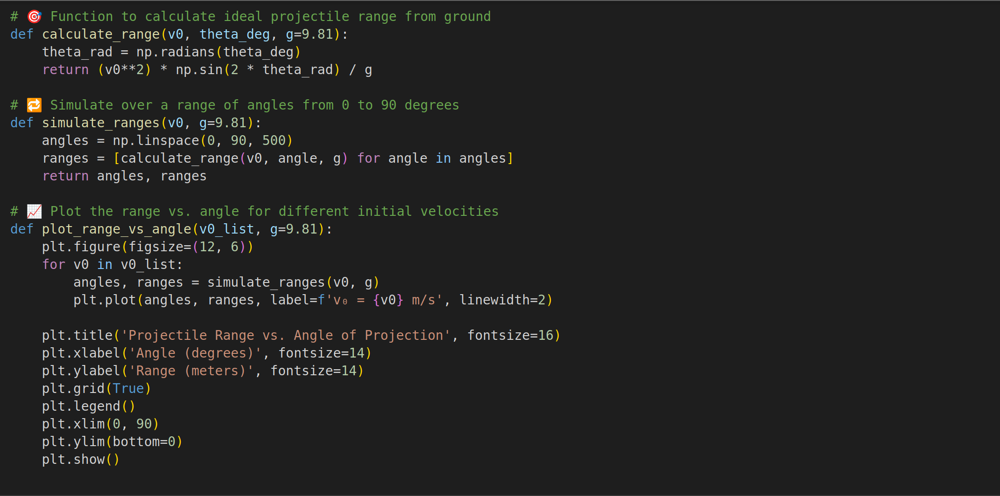
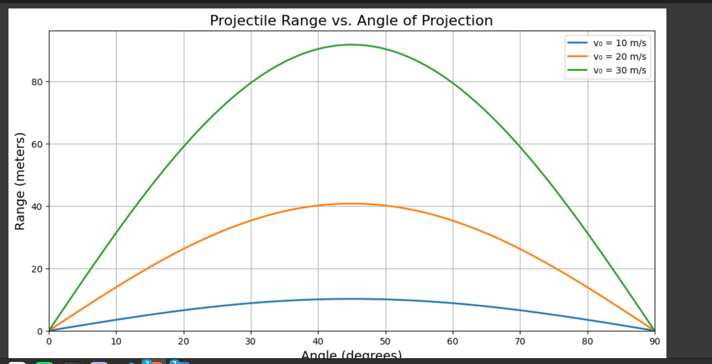
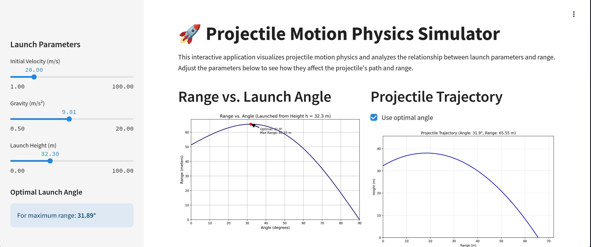

$$
\textbf{1. Theoretical Foundation}
$$

$$
\begin{equation*}
\begin{aligned}
&\text{We study the motion of a projectile under ideal conditions:} \\
&\bullet \ \text{Launched from the ground} \\
&\bullet \ \text{Initial velocity } v_0 \\
&\bullet \ \text{At an angle } \theta \text{ above the horizontal} \\
&\bullet \ \text{Subject to gravity } g \ (\text{constant}) \\
&\bullet \ \text{No air resistance} \\
&\text{We analyze the horizontal range as a function of the angle } \theta.
\end{aligned}
\end{equation*}
$$

$$
\textbf{1.1 Equations of Motion}
$$

$$
\begin{equation*}
\begin{aligned}
&\text{The motion is decomposed into two components:} \\
&\text{Horizontal position:} \quad x(t) = v_0 \cos(\theta) \cdot t \\
&\text{Vertical position:} \quad y(t) = v_0 \sin(\theta) \cdot t - \frac{1}{2}gt^2
\end{aligned}
\end{equation*}
$$

$$
\textbf{1.2 Time of Flight}
$$

$$
\begin{equation*}
\begin{aligned}
&\text{Set } y(t) = 0 \text{ to find total time in the air:} \\
&0 = v_0 \sin(\theta) \cdot t - \frac{1}{2}gt^2 \\
&\Rightarrow t \left(v_0 \sin(\theta) - \frac{1}{2}gt \right) = 0 \\
&\Rightarrow t = 0 \quad \text{or} \quad t = \frac{2v_0 \sin(\theta)}{g} \\
&\text{The second root gives the total flight time.}
\end{aligned}
\end{equation*}
$$

$$
\textbf{1.3 Range}
$$

$$
\begin{equation*}
\begin{aligned}
&\text{Horizontal range is the distance covered during full flight:} \\
&R = x\left(\frac{2v_0 \sin(\theta)}{g}\right) = v_0 \cos(\theta) \cdot \frac{2v_0 \sin(\theta)}{g} \\
&R = \frac{v_0^2 \sin(2\theta)}{g}
\end{aligned}
\end{equation*}
$$

$$
\textbf{1.4 Range Symmetry and Maximum}
$$

$$
\begin{equation*}
\begin{aligned}
&\text{The range depends on } \sin(2\theta), \text{ which is maximal when } 2\theta = 90^\circ. \\
&\Rightarrow \theta = 45^\circ \text{ gives maximum range.} \\
&\text{Since } \sin(2\theta) = \sin(180^\circ - 2\theta), \text{ we get:} \\
&R(\theta) = R(90^\circ - \theta) \\
&\text{Thus, angles like } 30^\circ \text{ and } 60^\circ \text{ yield the same range.}
\end{aligned}
\end{equation*}
$$

$$
\textbf{2. Analysis of the Range}
$$

$$
\textbf{2.1 Effect of Launch Angle}
$$

$$
\begin{equation*}
\begin{aligned}
&\text{The function } R = \frac{v_0^2 \sin(2\theta)}{g} \text{ shows that range varies with } \sin(2\theta). \\
&\text{Maximum occurs at } \theta = 45^\circ.
\end{aligned}
\end{equation*}
$$

$$
\textbf{2.2 Effect of Initial Velocity}
$$

$$
\begin{equation*}
\begin{aligned}
&R \propto v_0^2 \Rightarrow \text{doubling } v_0 \text{ quadruples the range.}
\end{aligned}
\end{equation*}
$$

$$
\textbf{2.3 Effect of Gravity}
$$

$$
\begin{equation*}
\begin{aligned}
&R \propto \frac{1}{g} \Rightarrow \text{lower gravity increases the range.} \\
&\text{Example: projectiles travel farther on the Moon.}
\end{aligned}
\end{equation*}
$$

$$
\textbf{3. Extensions and Applications}
$$

$$
\textbf{3.1 Launching from a Height}
$$

$$
\begin{equation*}
\begin{aligned}
&\text{If the launch occurs from height } h, \text{ the vertical position becomes:} \\
&y(t) = h + v_0 \sin(\theta) \cdot t - \frac{1}{2}gt^2 \\
&\text{Solve } y(t) = 0 \text{ (quadratic) to get time of flight, which is longer,} \\
&\text{and results in a greater horizontal range.}
\end{aligned}
\end{equation*}
$$

$$
\textbf{3.2 Including Air Resistance}
$$

$$
\begin{equation*}
\begin{aligned}
&\text{Air resistance adds a drag force:} \\
&\text{Linear model: } \quad m \frac{dv}{dt} = -mg - kv \\
&\text{Quadratic model: } \quad m \frac{dv}{dt} = -mg - kv^2 \\
&\text{These are solved numerically and generally reduce the range.}
\end{aligned}
\end{equation*}
$$

$$
\textbf{3.3 Real-World Applications}
$$

$$
\begin{equation*}
\begin{aligned}
&\text{Projectile motion applies to:} \\
&\bullet \ \text{Sports: basketball, football, javelin} \\
&\bullet \ \text{Engineering: ballistics, drone pathing} \\
&\bullet \ \text{Space: orbital insertion, moon landings}
\end{aligned}
\end{equation*}
$$

 
 --visual simulation--

 
 https://replit.com/@gewfwewegfwef/ProjectileRangePlotter
 