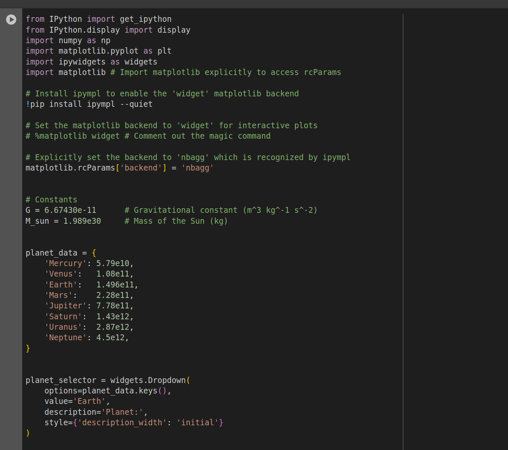
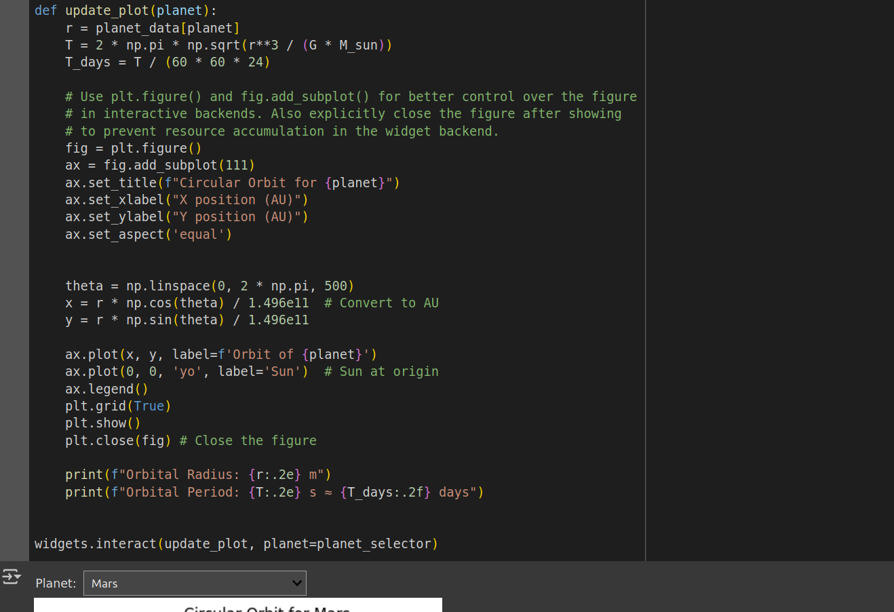
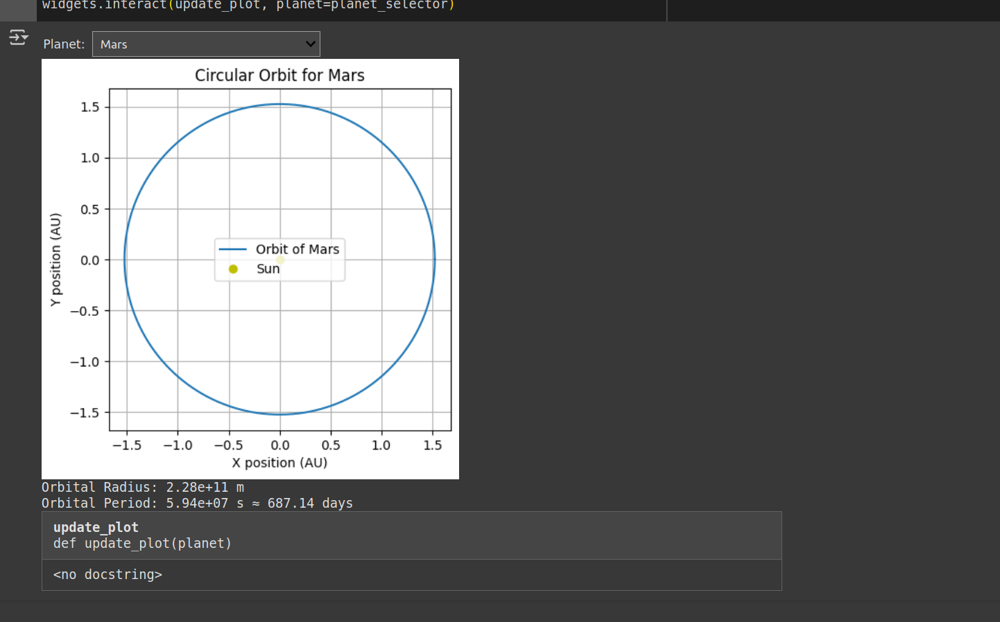

# Gravity – Problem 1: Orbital Period and Orbital Radius

## 1. Derivation: Kepler’s Third Law for Circular Orbits

For a body of mass \( m \) in a circular orbit of radius \( r \) around a central mass \( M \), the gravitational force provides the centripetal force:

$$
F_{\text{gravity}} = \frac{G M m}{r^2}, \quad F_{\text{centripetal}} = \frac{m v^2}{r}
$$

Setting these equal:

$$
\frac{G M m}{r^2} = \frac{m v^2}{r} \Rightarrow v^2 = \frac{G M}{r}
$$

The orbital period \( T \) is the time to complete one orbit:

$$
T = \frac{2\pi r}{v} \Rightarrow T^2 = \frac{4\pi^2 r^2}{v^2}
\Rightarrow T^2 = \frac{4\pi^2 r^3}{G M}
$$

This gives **Kepler’s Third Law**:

$$
T^2 \propto r^3
$$

---

## 2. Implications for Astronomy

- **Mass Determination**: Given \( T \) and \( r \), one can determine the mass of the central body using:

$$
M = \frac{4\pi^2 r^3}{G T^2}
$$

- **Distance Estimation**: If \( T \) is known (e.g., from observation), \( r \) can be calculated, and vice versa.

- **Universal Application**: Applies not just to planets but to moons, satellites, and binary stars (modulo elliptical corrections).

---

## 3. Real-World Examples

### The Moon around Earth

- \( T = 27.3 \) days \( \approx 2.36 \times 10^6 \, \text{s} \)
- \( r \approx 3.84 \times 10^8 \, \text{m} \)

Compute Earth's mass using Kepler's law:

$$
M \approx \frac{4\pi^2 r^3}{G T^2} \approx 5.97 \times 10^{24} \, \text{kg}
$$

### Planets in the Solar System

A plot of 
$$
\( \log(T^2) \) vs \( \log(r^3) \)
$$
for planets will yield a straight line with slope ≈ 1, verifying the law.

---

## 5. Discussion: Beyond Circular Orbits

For elliptical orbits:

- Replace \( r \) with the semi-major axis \( a \).
- Kepler's law generalizes to:

$$
T^2 = \frac{4\pi^2 a^3}{G M}
$$

- The law still holds, but more complex motion requires numerical simulations (e.g., Runge-Kutta integration).
- This generalization is crucial in characterizing exoplanets and binary star systems.

---

## Conclusion

Kepler’s Third Law, derived from Newtonian mechanics, is a foundational result in celestial mechanics. It provides a direct connection between gravitational theory and observable planetary motion, allowing for:

- Mass and distance calculations.
- System architecture analysis.
- Extension to satellites, moons, and stars.

Simulations and real-world data confirm its accuracy and importance in astronomy.

