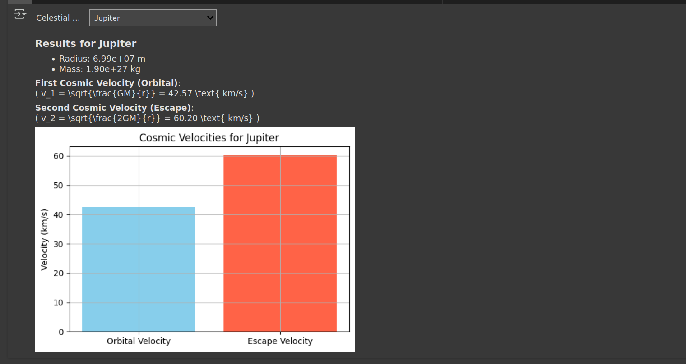

# Problem 2# Problem 2: Escape Velocities and Cosmic Velocities

## 1. Definitions

- **First Cosmic Velocity (Orbital Velocity)**: The minimum speed needed to maintain a circular orbit around a planet.
$$v_1 = \sqrt{\frac{G M}{r}}$$

- **Second Cosmic Velocity (Escape Velocity)**: The speed needed to escape a planet's gravitational field without further propulsion.
  $$v_2 = \sqrt{\frac{2 G M}{r}} = \sqrt{2} \cdot v_1$$

- **Third Cosmic Velocity**: The speed required to escape the Sun's gravity from Earth’s orbit — i.e., to leave the Solar System.
  $$v_3 = \sqrt{v_{\text{esc,Earth}}^2 + v_{\text{orb,Earth}}^2}$$

## 2. Mathematical Analysis

Where:
- \( G = 6.67430 \times 10^{-11} \, \text{m}^3\text{kg}^{-1}\text{s}^{-2} \)
- \( M \): Mass of the celestial body
- \( r \): Distance from the center of the body

### Derivation:

From gravitational potential and kinetic energy balance:
- Escape: \( \frac{1}{2}mv^2 = \frac{G M m}{r} \)
- Solve for \( v \): \( v = \sqrt{\frac{2 G M}{r}} \)

## 3. Real-World Examples

| Body     | Radius (m)     | Mass (kg)       | Orbital Velocity (m/s) | Escape Velocity (m/s) |
|----------|----------------|------------------|--------------------------|-------------------------|
| Earth    | \(6.37 \times 10^6\) | \(5.97 \times 10^{24}\) | ~7.91 km/s              | ~11.2 km/s              |
| Mars     | \(3.39 \times 10^6\) | \(6.39 \times 10^{23}\) | ~3.55 km/s              | ~5.03 km/s              |
| Jupiter  | \(6.99 \times 10^7\) | \(1.90 \times 10^{27}\) | ~42.1 km/s              | ~59.5 km/s              |

## 4. Importance in Space Exploration

- **v₁**: Used to put satellites into orbit.
- **v₂**: Required for planetary escape (e.g., space missions to Mars or beyond).
- **v₃**: Needed for interstellar missions (e.g., Voyager).

---

## Conclusion

Understanding cosmic velocities is essential for mission design and orbital mechanics. The escape and orbital speeds define the energy requirements for launching spacecraft and exploring other worlds.

