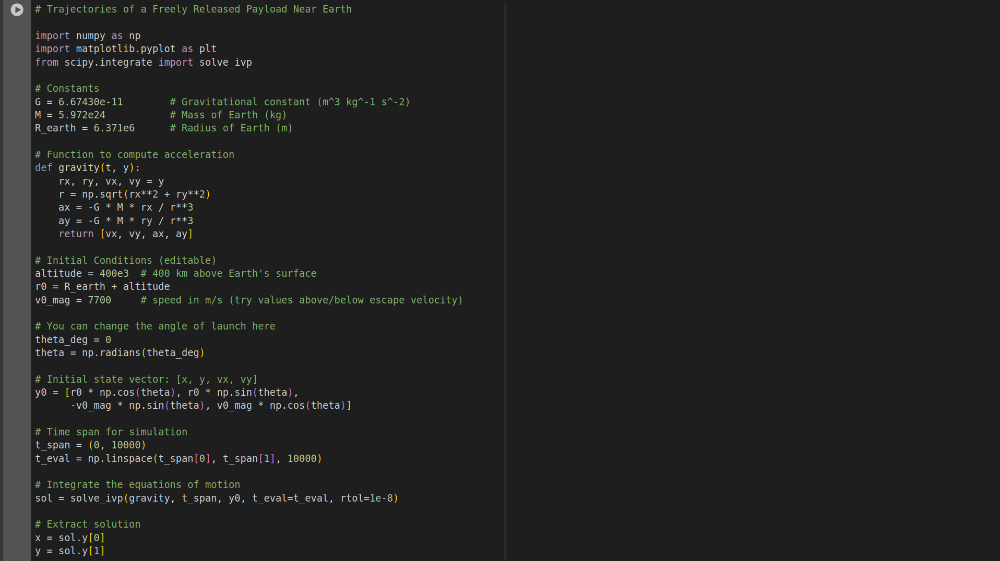
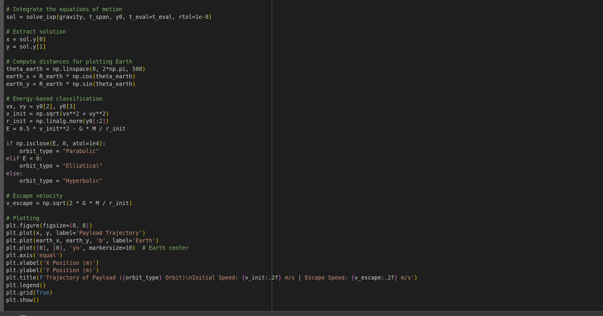
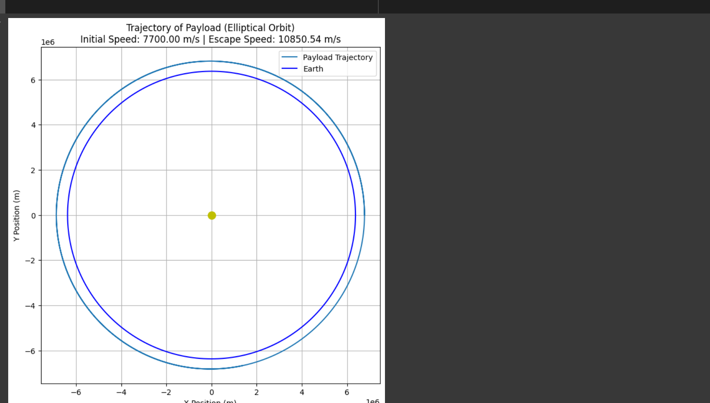

# Problem 3# Problem 3: Trajectories of a Freely Released Payload Near Earth

## Motivation

In orbital mechanics, a critical challenge is predicting how objects behave when released in Earth's gravitational field. A payload released from a rocket can follow vastly different paths depending on its velocity, direction, and altitude. Understanding these trajectories is key to:

- **Satellite deployment**
- **Reentry capsule navigation**
- **Mission abort procedures**
- **Escape trajectory planning**

This problem blends Newtonian gravity, Keplerian orbits, and computational physics to explore a wide range of behaviors in orbital dynamics.

---

## 1. Gravitational Force and Equations of Motion

The motion of a payload is governed by Newton's Law of Universal Gravitation:

$$
\vec{F}_{\text{gravity}} = -\frac{GMm}{r^2} \hat{r}
$$

Which results in the acceleration:

$$
\vec{a} = \frac{\vec{F}}{m} = -\frac{GM}{r^2} \hat{r} = -\frac{GM}{r^3} \vec{r}
$$

Where:
- \( G = 6.67430 \times 10^{-11} \, \text{m}^3 \text{kg}^{-1} \text{s}^{-2} \) is the gravitational constant
- \( M \) is the Earth's mass
- \( m \) is the payload mass (cancels out in motion equations)
- \( \vec{r} \) is the position vector from Earth's center

This forms a second-order ordinary differential equation (ODE):

$$
\frac{d^2 \vec{r}}{dt^2} = -\frac{GM}{r^3} \vec{r}
$$

---

## 2. Trajectory Classification Based on Total Mechanical Energy

The trajectory of a payload depends on its total **specific mechanical energy** \( E \), given by:

$$
E = \frac{v^2}{2} - \frac{GM}{r}
$$

The type of trajectory depends on the sign of \( E \):

| Trajectory Type | Condition           | Description                           |
|------------------|---------------------|----------------------------------------|
| Circular orbit   | \( E < 0 \), \( v = v_c \) | Constant radius around Earth       |
| Elliptical orbit | \( E < 0 \), \( v < v_{\text{esc}} \) | Closed orbit but not circular     |
| Parabolic        | \( E = 0 \)         | Just escapes Earth's gravity         |
| Hyperbolic       | \( E > 0 \)         | Escapes with excess energy           |
| Ballistic        | \( v \) insufficient for orbit | Returns to Earth                  |

Where:
- \( v_{\text{esc}} = \sqrt{\frac{2GM}{r}} \): escape velocity
- \( v_c = \sqrt{\frac{GM}{r}} \): circular orbital velocity

---

## 3. Numerical Simulation of Motion

We can numerically integrate the second-order equation using time-stepping techniques like **Euler** or **Runge-Kutta** methods:

Let:
- \( \vec{v}_{t+1} = \vec{v}_t + \vec{a}_t \Delta t \)
- \( \vec{r}_{t+1} = \vec{r}_t + \vec{v}_{t+1} \Delta t \)

At each step:
1. Calculate current distance \( r = |\vec{r}| \)
2. Compute acceleration \( \vec{a} = -\frac{GM}{r^3} \vec{r} \)
3. Update velocity and position vectors

We simulate motion over time to trace the trajectory.

---

## 4. Initial Conditions: Velocity and Launch Angle

Assume payload is released from low Earth orbit (LEO) at altitude \( h \), so:

$$
r_0 = R_{\text{Earth}} + h
$$

Let the initial velocity be \( v_0 \), launched at an angle \( \theta \) above the horizontal:

- \( v_x = v_0 \cos(\theta) \)
- \( v_y = v_0 \sin(\theta) \)

Different values of \( v_0 \) and \( \theta \) will result in different trajectory outcomes:
- Too small \( v_0 \): payload falls back
- \( v_0 \approx v_c \): stable orbit
- \( v_0 \geq v_{\text{esc}} \): escape trajectory

---

## 5. Real-World Applications

Understanding these trajectories is critical for:

### Orbital Insertion
Used to place satellites in specific orbits by releasing them at correct speed and angle.

### Reentry Calculations
Returning astronauts or probes safely to Earth requires simulating descent paths.

###  Escape Missions
Launching missions to the Moon or Mars requires achieving escape velocity with the correct direction.

###  Mission Abort
Emergency payload releases or capsule separation must be simulated to ensure safety and landing precision.

---

## 6. Limitations and Extensions

This simulation assumes:
- No atmospheric drag
- Only Earth’s gravity
- Spherical Earth model

Further accuracy could involve:
- Drag modeling
- Earth's oblateness
- Lunar and solar perturbations
- Rotating frame of reference

---

## 7. Conclusion

The trajectory of a freely released payload near Earth is governed by gravitational dynamics and initial velocity vectors. By simulating the equations of motion, we can explore the boundary between orbital mechanics, escape physics, and atmospheric reentry — foundational for modern space exploration.

