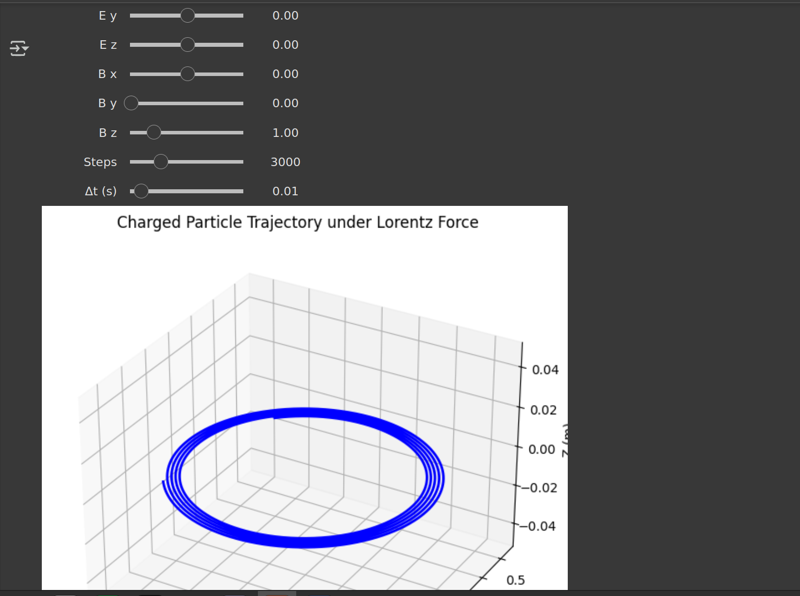

# Electromagnetism – Lorentz Force and Its Applications

---

## 1. The Lorentz Force

The **Lorentz force** is the total electromagnetic force experienced by a charged particle moving through electric and magnetic fields. It is given by:

$$
\vec{F} = q(\vec{E} + \vec{v} \times \vec{B})
$$

Where:

- \( \vec{F} \): Total force on the particle (N)  
- \( q \): Electric charge of the particle (C)  
- \( \vec{E} \): Electric field vector (V/m)  
- \( \vec{v} \): Velocity of the particle (m/s)  
- \( \vec{B} \): Magnetic field vector (T)  

### Key Characteristics:

- The electric field contributes a force in the direction of the field (or opposite for negative charges).
- The magnetic field contributes a force that is perpendicular to both the velocity of the particle and the magnetic field.
- The magnetic component does not do work (it changes direction but not speed).
- The electric component can do work and change the particle’s kinetic energy.

---

## 2. Motion of Charged Particles in Fields

### A. In a Uniform Electric Field

If only an electric field is present:

$$
\vec{F} = q\vec{E} \quad \Rightarrow \quad m\frac{d\vec{v}}{dt} = q\vec{E}
$$

Uniform acceleration results:

$$
\vec{v}(t) = \vec{v}_0 + \frac{q\vec{E}}{m}t
$$

$$
\vec{r}(t) = \vec{r}_0 + \vec{v}_0 t + \frac{1}{2} \frac{q\vec{E}}{m} t^2
$$

The motion is **parabolic**, similar to projectile motion under gravity.

---

### B. In a Uniform Magnetic Field

When \( \vec{E} = 0 \) and only a magnetic field exists:

$$
\vec{F} = q(\vec{v} \times \vec{B})
$$

This results in circular or helical motion.

#### Important Quantities:

- **Larmor radius (cyclotron radius)**

$$
r_L = \frac{mv_\perp}{qB}
$$

- **Cyclotron frequency**

$$
\omega_c = \frac{qB}{m}
$$

- **Period of rotation**

$$
T = \frac{2\pi m}{qB}
$$

Where \( v_\perp \) is the velocity component perpendicular to \( \vec{B} \).

- If \( \vec{v} \perp \vec{B} \): Circular motion.
- If \( \vec{v} \) has a component along \( \vec{B} \): Helical motion.

---

### C. In Combined Electric and Magnetic Fields

General form:

$$
\vec{F} = q(\vec{E} + \vec{v} \times \vec{B})
$$

#### 1. Parallel Fields: \( \vec{E} \parallel \vec{B} \)

- Accelerates particle along the field direction.

#### 2. Perpendicular Fields: \( \vec{E} \perp \vec{B} \)

- Results in **E-cross-B drift**:

$$
\vec{v}_{\text{drift}} = \frac{\vec{E} \times \vec{B}}{B^2}
$$

- The particle undergoes circular motion while its orbit center drifts uniformly in the perpendicular direction.

---

## 3. Applications of the Lorentz Force

| System | Role of Lorentz Force |
|--------|------------------------|
| Particle Accelerators | Guide and accelerate particles using electric/magnetic fields |
| Mass Spectrometers | Separate ions by mass-to-charge ratio |
| Plasma Confinement | Trap plasma using magnetic fields |
| Cathode Ray Tubes | Deflect electron beams for image display |
| Hall Sensors | Measure magnetic fields using transverse voltage |

---

## 4. Key Physical Concepts

| Concept | Formula | Description |
|--------|---------|-------------|
| Lorentz Force | \( \vec{F} = q(\vec{E} + \vec{v} \times \vec{B}) \) | Total electromagnetic force |
| Larmor Radius | \( r_L = \frac{mv_\perp}{qB} \) | Radius of circular motion in magnetic field |
| Cyclotron Frequency | \( \omega_c = \frac{qB}{m} \) | Frequency of circular motion |
| E×B Drift | \( \vec{v}_{\text{drift}} = \frac{\vec{E} \times \vec{B}}{B^2} \) | Uniform drift velocity in crossed fields |

---

## 5. Types of Particle Motion Summary

| Field Configuration | Motion Type |
|---------------------|-------------|
| \( \vec{E} \) only | Parabolic (accelerated) |
| \( \vec{B} \) only, \( \vec{v} \perp \vec{B} \) | Circular |
| \( \vec{B} \) only, \( \vec{v} \not\perp \vec{B} \) | Helical |
| \( \vec{E} \parallel \vec{B} \) | Linear acceleration |
| \( \vec{E} \perp \vec{B} \) | Drift + circular motion (spiral path) |

---

## 6. Summary

- The Lorentz force governs charged particle dynamics in electromagnetic fields.
- Electric fields affect speed (kinetic energy); magnetic fields affect direction.
- The resulting motion may be circular, helical, or exhibit drift, depending on the configuration.
- This principle underlies many devices and techniques in physics, engineering, and medical imaging.

interactive link https://colab.research.google.com/drive/1luBVZKsQt-xeJD32WD283miE4L5eFPEb#scrollTo=lhhA791zTICc