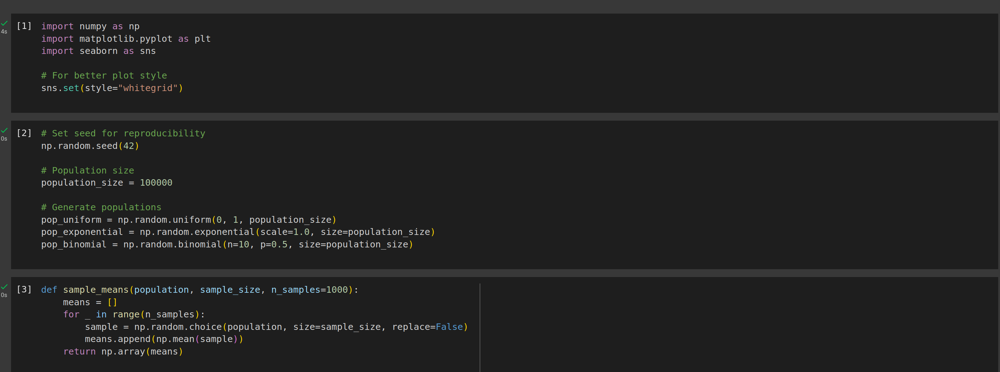
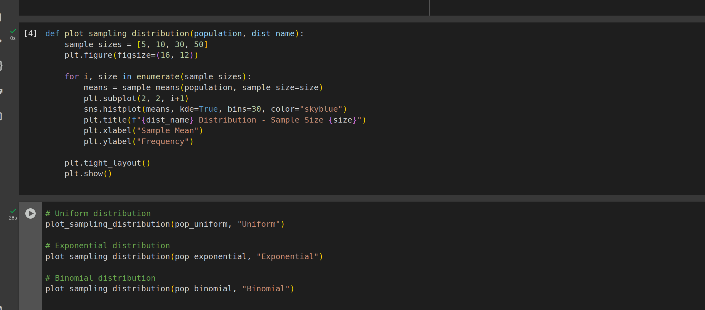
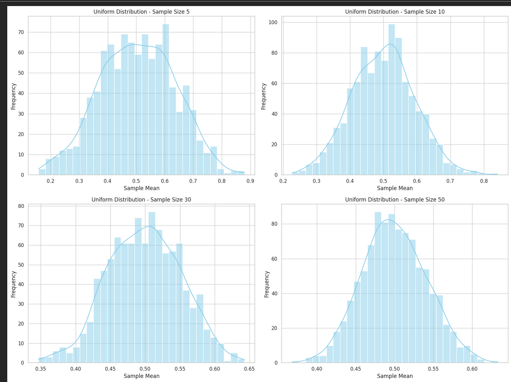
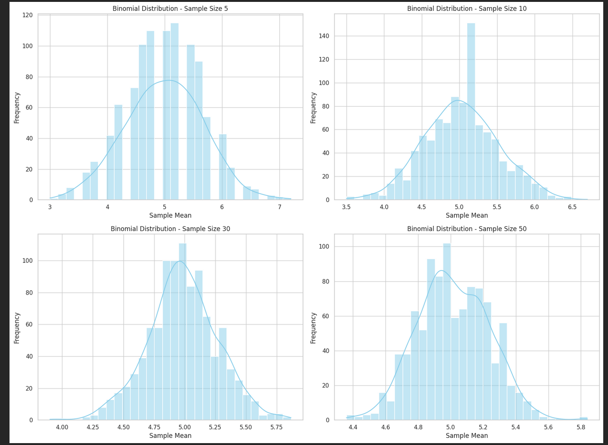
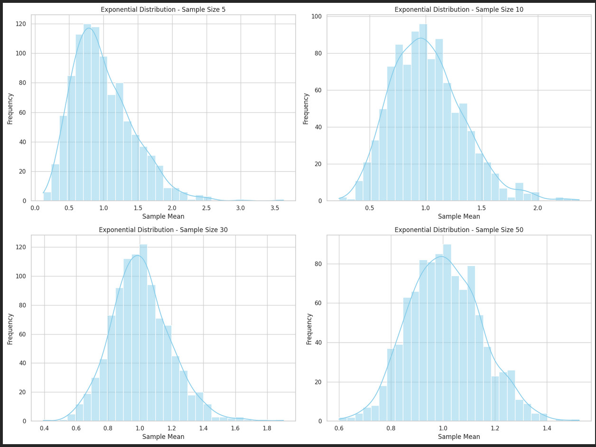

# Central Limit Theorem – Simulation Summary with Mathematical Notation

##  What is the Central Limit Theorem (CLT)?

The **Central Limit Theorem (CLT)** states:

$$
\text{If } X_1, X_2, \ldots, X_n \text{ are i.i.d. random variables with mean } \mu \text{ and variance } \sigma^2, \text{ then as } n \to \infty,
$$

$$
\bar{X}_n = \frac{1}{n} \sum_{i=1}^n X_i \xrightarrow{d} \mathcal{N}\left(\mu, \frac{\sigma^2}{n}\right)
$$

That is, the **sampling distribution of the sample mean** approaches a **normal distribution**, even if the original data are not normally distributed.

---

##  Simulation Methodology

1. Generate a large population from each of three distributions:
   - **Uniform**: \( X \sim \mathcal{U}(0, 1) \)
   - **Exponential**: \( X \sim \text{Exp}(\lambda = 1) \)
   - **Binomial**: \( X \sim \text{Bin}(n=10, p=0.5) \)

2. For each population:
   - Draw \( N = 1000 \) random samples of size \( n \in \{5, 10, 30, 50\} \)
   - Compute sample means:  
     $$\bar{X}_i = \frac{1}{n} \sum_{j=1}^n x_{ij}$$

3. Plot the histogram of the sampling distribution of \( \bar{X} \)

---

##  Results by Distribution

###  Uniform Distribution: \( X \sim \mathcal{U}(0, 1) \)

- Symmetric, bounded distribution.
- Sample means converge quickly to normality.

| Sample Size | Observation |
|-------------|-------------|
| \( n = 5 \) | Slightly rough shape |
| \( n = 10 \) | Bell shape starts to form |
| \( n = 30, 50 \) | Clearly normal-shaped |

CLT holds well even for small \( n \).

---

### 2 Exponential Distribution: \( X \sim \text{Exp}(1) \)

- Right-skewed, unbounded.
- Takes larger \( n \) for convergence.

| Sample Size | Observation |
|-------------|-------------|
| \( n = 5 \) | Strong right skew |
| \( n = 10 \) | Still skewed |
| \( n = 30 \) | More symmetric |
| \( n = 50 \) | Nearly normal |

 Larger \( n \) needed for CLT to apply effectively.

---

### 3️ Binomial Distribution: \( X \sim \text{Bin}(10, 0.5) \)

- Discrete, symmetric when \( p = 0.5 \)
- Sample means become continuous-looking as \( n \) increases.

| Sample Size | Observation |
|-------------|-------------|
| \( n = 5 \) | Jagged/stepped |
| \( n = 10 \) | Becoming smoother |
| \( n = 30, 50 \) | Smooth and bell-shaped |

 Discreteness fades with larger \( n \); CLT applies.

---

##  Summary Table

| Distribution   | Skewed? | Fast Convergence? | Normality at \( n = 50 \) |
|----------------|--------|-------------------|----------------------------|
| Uniform        |  No   | Yes            | Yes                     |
| Exponential    |  Yes  |  No             | Approximates Normal     |
| Binomial       |  Low  | Moderate       | Yes                     |

---

##  Key Theoretical Insights

- As \( n \) increases:
  - \( \bar{X} \sim \mathcal{N}(\mu, \sigma^2/n) \)
  - The **variance** of the sample mean decreases:
    $$
    \text{Var}(\bar{X}) = \frac{\sigma^2}{n}
    $$

- CLT applies **regardless of population shape**, but convergence speed depends on skewness and kurtosis.

---

## Applications of CLT

- **Quality Control**: Predict batch quality from samples
- **Healthcare**: Infer population health statistics
- **Finance**: Estimate expected returns and risks
- **Polling**: Use voter samples to predict elections

---

## Conclusion

The Central Limit Theorem is powerful because it allows the use of **normal-based methods** (confidence intervals, hypothesis testing) on data from **non-normal populations**, provided the sample size is sufficiently large.

