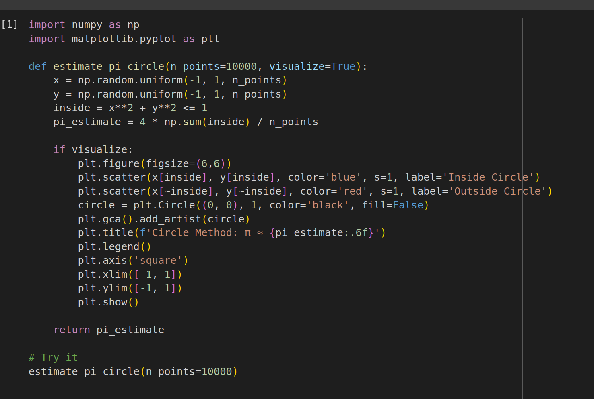
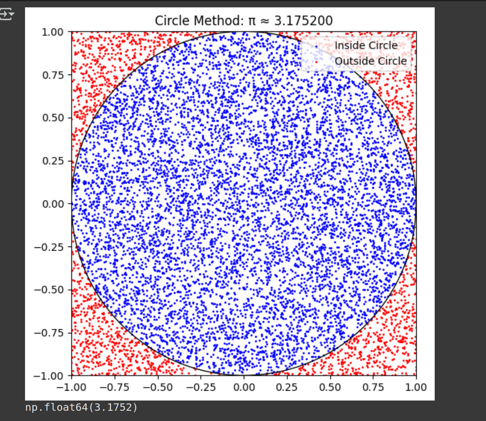
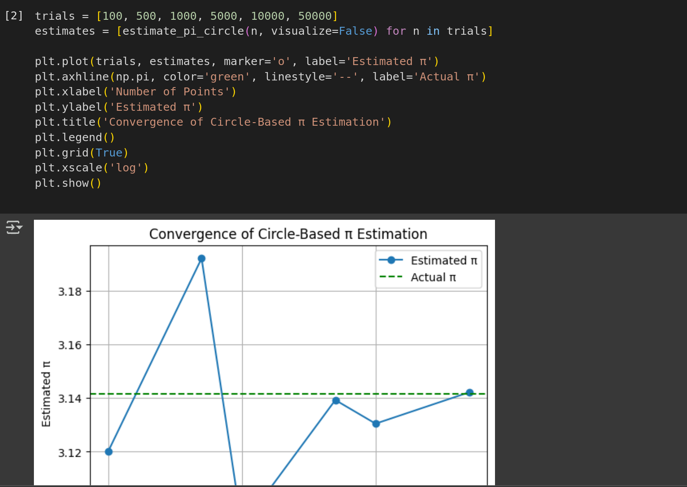
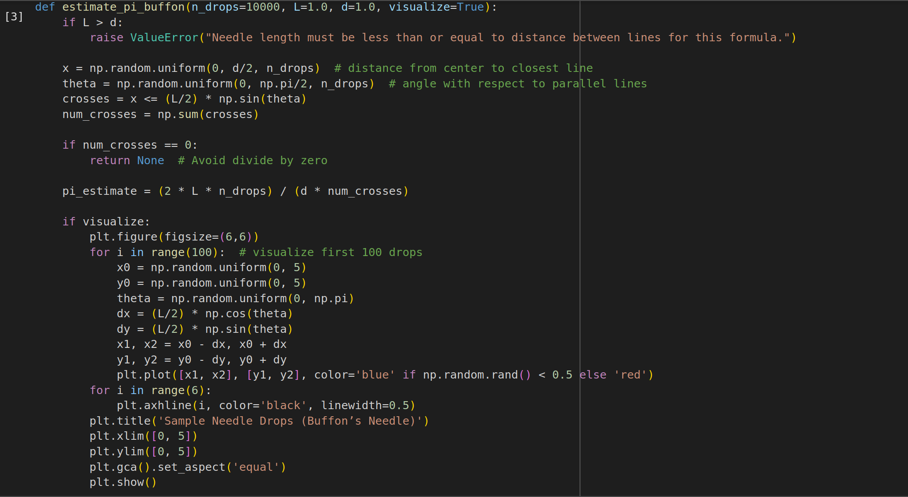
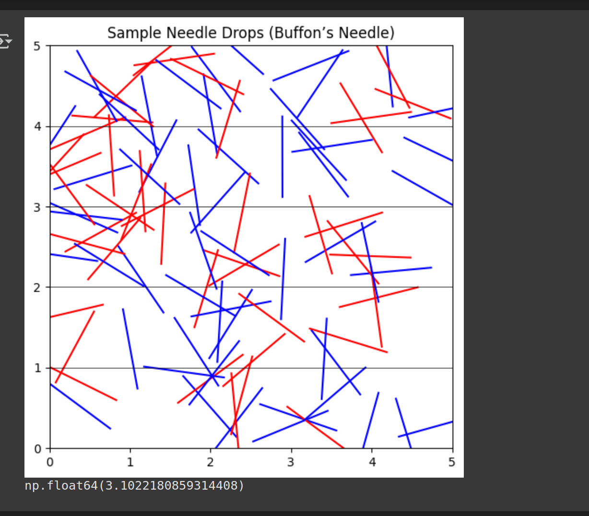
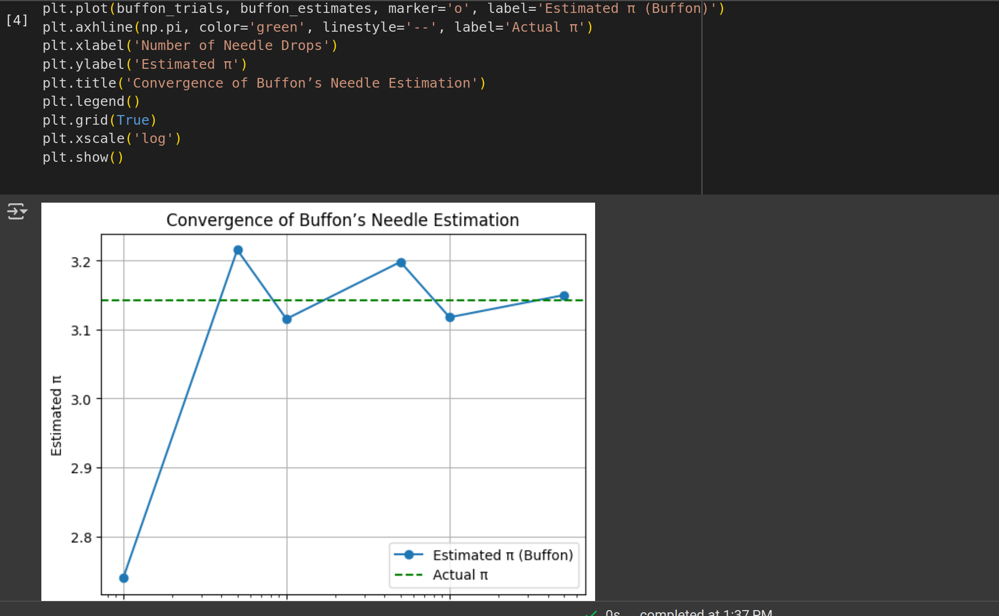

# Problem 2
#  Estimating \( \pi \) using Monte Carlo Methods

##  Motivation

Monte Carlo simulations are a powerful class of algorithms that rely on randomness to solve mathematical problems. One elegant example is estimating the value of \( \pi \) using geometric probability. This connects probability, geometry, and numerical methods, and demonstrates how random simulations can approximate constants like \( \pi \).

---

## Part 1: Estimating \( \pi \) using the Circle Method

###  1. Theoretical Foundation

We consider a unit circle of radius \( r = 1 \) inscribed inside a square of side length 2.

- Area of the circle:  
  $$
  A_{\text{circle}} = \pi r^2 = \pi
  $$
- Area of the square:  
  $$
  A_{\text{square}} = (2r)^2 = 4
  $$

The **probability** that a point randomly chosen inside the square also lies inside the circle is:

$$
P = \frac{A_{\text{circle}}}{A_{\text{square}}} = \frac{\pi}{4}
$$

Thus, rearranging:

$$
\pi \approx 4 \cdot \frac{\text{Number of points inside circle}}{\text{Total number of points}}
$$

---

###  2. Simulation Steps

- Generate \( N \) random points \( (x_i, y_i) \) uniformly in the square \( [-1, 1] \times [-1, 1] \)
- For each point, check if it lies inside the circle:  
  $$
  x_i^2 + y_i^2 \leq 1
  $$
- Count how many points fall inside the circle, call this \( M \)
- Estimate:  
  $$
  \hat{\pi} = 4 \cdot \frac{M}{N}
  $$

--- 

###  3. Visualization

- Use color to distinguish:
  - Points inside the circle (e.g. blue)
  - Points outside the circle (e.g. red)
- Draw the boundary of the unit circle and square for reference.

---

###  4. Analysis

- As \( N \to \infty \), the estimate \( \hat{\pi} \to \pi \)
- **Convergence is slow**: error typically decreases proportionally to  
  $$
  \mathcal{O}\left(\frac{1}{\sqrt{N}}\right)
  $$
- More points lead to better accuracy but increased computation

---

## Part 2: Estimating \( \pi \) using Buffon’s Needle

###  1. Theoretical Foundation

Buffon's Needle is a classic probability problem:

- Drop a needle of length \( L \) onto a plane with parallel lines spaced \( d \) units apart
- If \( L \leq d \), the probability the needle crosses a line is:  
  $$
  P = \frac{2L}{\pi d}
  $$

Rearranged:

$$
\pi \approx \frac{2L \cdot \text{Number of trials}}{d \cdot \text{Number of hits}}
$$

---

###  2. Simulation Steps

- Set needle length \( L \) and line spacing \( d \) (commonly, \( L = d = 1 \))
- For each drop:
  - Randomly generate the distance from the center of the needle to the nearest line:  
    \( x \sim \text{Uniform}(0, \frac{d}{2}) \)
  - Randomly generate the needle’s angle \( \theta \sim \text{Uniform}(0, \frac{\pi}{2}) \)
  - A hit occurs if:  
    $$
    x \leq \frac{L}{2} \sin(\theta)
    $$
- Count hits and estimate \( \pi \)

---

###  3. Visualization

- Draw needle positions on a plane with horizontal lines
- Show hit (crossing) vs miss (non-crossing) in different colors
- Useful for understanding random geometry

---

### 4. Analysis

- Convergence is slower than the circle method
- Estimate accuracy depends on number of trials \( N \)
- More mathematically rich but computationally more complex

---

##  Comparison of Methods

| Method           | Visual Simplicity | Convergence Rate | Complexity | Fun Factor |
|------------------|-------------------|------------------|------------|------------|
| Circle Method    | ✅ Easy to plot    | 🟢 Moderate       | 🔽 Simple   | 🌟🌟🌟🌟     |
| Buffon’s Needle  | 🟡 Medium          | 🔴 Slower         | 🔼 Geometric | 🌟🌟🌟       |

---

## ✅ Conclusion

Monte Carlo methods show how randomness can yield precise numerical results. Estimating \( \pi \) using geometric probability is a clear, engaging application of:

- **Simulation techniques**
- **Probability theory**
- **Computational thinking**

Both methods showcase the power and limitations of Monte Carlo estimation in an intuitive way.

