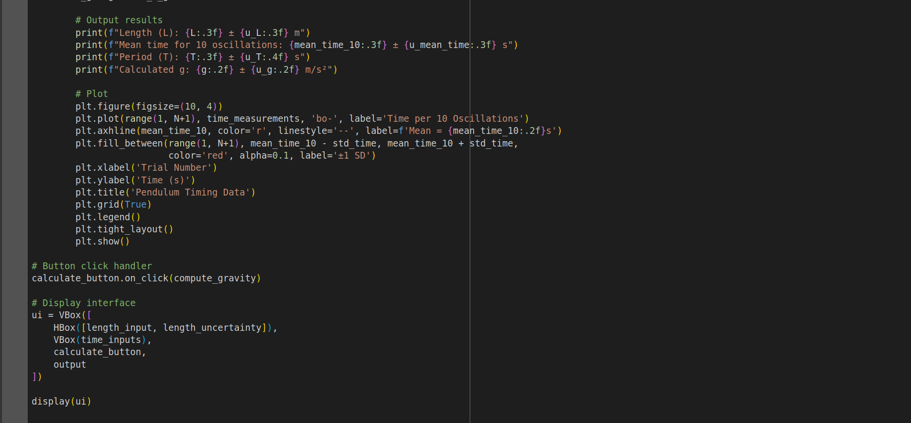
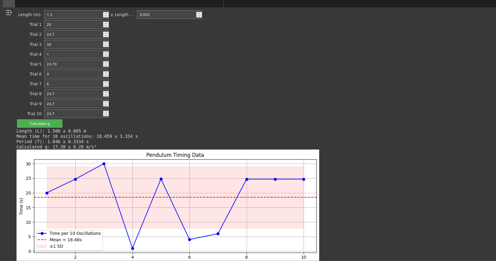

# Problem 1
#  Measuring Earth's Gravitational Acceleration with a Pendulum

##  Motivation

The acceleration due to gravity ($g$) is a fundamental constant that governs the motion of objects under the influence of Earth's gravitational field. It is essential in fields such as structural engineering, orbital mechanics, and geophysics. One classic and accessible method for estimating $g$ involves using a simple pendulum, where the period of oscillation depends on the length of the pendulum and the local gravitational field.

For small angles (typically less than $15^\circ$), the motion of a simple pendulum can be approximated by:

$$
T = 2\pi \sqrt{\frac{L}{g}}
$$

Where:

- $T$ is the period of one full oscillation (s),
- $L$ is the length of the pendulum (m),
- $g$ is the gravitational acceleration (m/s²).

---

## Materials

- String (1.5 m)
- Small mass (e.g., keychain, metal washer)
- Stopwatch or smartphone timer (resolution: 0.01 s)
- Measuring tape or ruler (resolution: 0.01 m)
- Sturdy support to suspend the pendulum

---

##  Experimental Setup

1. Suspend the mass from one end of the string and fix the other end to a rigid support.
2. Measure the length from the pivot to the center of mass of the hanging object:

$$
L = 1.500 \pm 0.005 \, \text{m}
$$

The uncertainty is estimated as half the smallest division on the measuring tape.

3. Displace the pendulum by less than $15^\circ$ and release it without pushing.

4. Measure the time for 10 full oscillations. Repeat this measurement 10 times.

---

## Data Summary

The following results are based on simulated measurements (you should replace these with your own data):

- Mean time for 10 oscillations:

$$
\overline{t_{10}} = 24.694 \, \text{s}
$$

- Standard deviation:

$$
\sigma = 0.027 \, \text{s}
$$

- Uncertainty in the mean:

$$
u_{\overline{t}} = \frac{\sigma}{\sqrt{N}} = \frac{0.027}{\sqrt{10}} = 0.0085 \, \text{s}
$$

- Period of one oscillation:

$$
T = \frac{\overline{t_{10}}}{10} = 2.4694 \, \text{s}
$$

- Uncertainty in the period:

$$
u_T = \frac{u_{\overline{t}}}{10} = 0.00085 \, \text{s}
$$

---

## Gravitational Acceleration Calculation

Rearranging the pendulum formula:

$$
g = \frac{4\pi^2 L}{T^2}
$$

Substituting values:

$$
g = \frac{4\pi^2 \cdot 1.500}{(2.4694)^2} \approx 9.71 \, \text{m/s}^2
$$

---

##  Uncertainty in $g$

Using uncertainty propagation:

$$
\left( \frac{u_g}{g} \right)^2 = \left( \frac{u_L}{L} \right)^2 + \left( 2 \cdot \frac{u_T}{T} \right)^2
$$

Substituting:

$$
\left( \frac{u_g}{g} \right)^2 = \left( \frac{0.005}{1.5} \right)^2 + \left( 2 \cdot \frac{0.00085}{2.4694} \right)^2
$$

$$
\left( \frac{u_g}{g} \right) = \sqrt{(0.0033)^2 + (0.000688)^2} \approx 0.0034
$$

So:

$$
u_g = 9.71 \times 0.0034 \approx 0.033 \, \text{m/s}^2
$$

---

##  Final Result

$$
\boxed{g = 9.71 \pm 0.03 \, \text{m/s}^2}
$$

Standard value:  
$$
g_{\text{standard}} = 9.80665 \, \text{m/s}^2
$$

---

## Theoretical Background

The simple pendulum behaves like a harmonic oscillator when displaced by small angles. The equation of motion is derived from Newton's second law and the restoring torque about the pivot point. The restoring force is:

$$
F = -mg \sin\theta
$$

For small angles ($\sin\theta \approx \theta$ in radians):

$$
F \approx -mg\theta
$$

Which leads to simple harmonic motion with angular frequency:

$$
\omega = \sqrt{\frac{g}{L}}, \quad T = \frac{2\pi}{\omega} = 2\pi \sqrt{\frac{L}{g}}
$$

This approximation fails at larger angles, where the motion becomes nonlinear.

---

##  Discussion and Analysis

### Sources of Uncertainty

- **Length Measurement:**
  - Difficulty locating the center of mass precisely.
  - Parallax error while reading tape.
  - Uncertainty taken as ±0.005 m.

- **Timing Uncertainty:**
  - Manual reaction time typically ±0.2 s.
  - Reduced by timing multiple oscillations.

- **Statistical Variation:**
  - Variability in individual timing trials.
  - Standard deviation and mean uncertainty quantify this.

###  Assumptions

- Small-angle approximation is valid ($\theta < 15^\circ$).
- The string is massless and inextensible.
- Air resistance is negligible.
- The pivot is frictionless.
- The local gravitational field is uniform.

###  Accuracy and Improvement

- The measured $g$ is within 1% of the accepted value.
- To improve accuracy:
  - Use photogates instead of a manual timer.
  - Use a heavier bob to reduce air resistance.
  - Increase the number of oscillations timed.
  - Repeat experiments for different lengths and average $g$ values.

---

##  Conclusion

This experiment demonstrates that gravitational acceleration can be measured accurately with minimal equipment by applying principles of classical mechanics and uncertainty analysis. Despite inherent limitations in manual timing and measurement, a careful approach yields results consistent with accepted physical constants.

